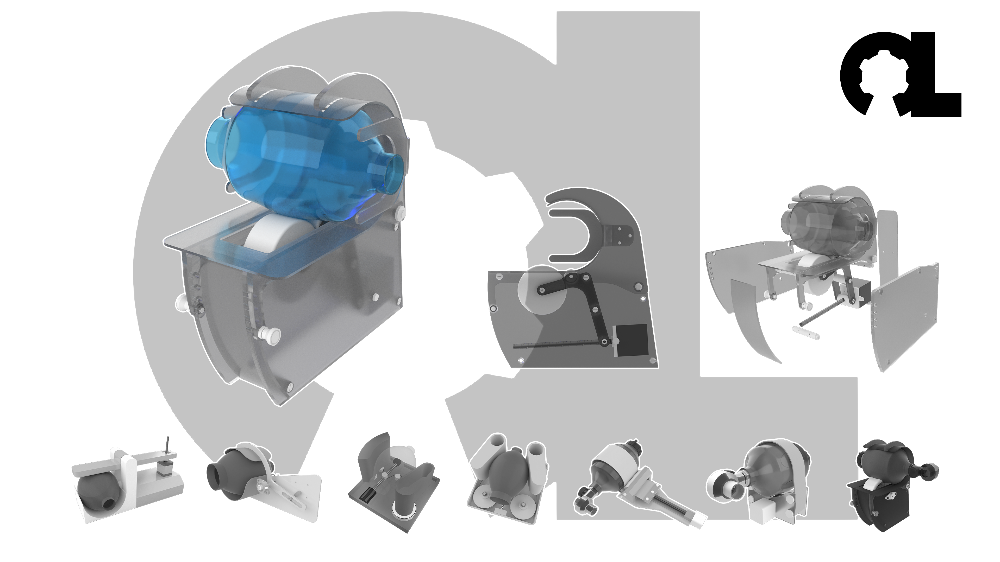

# Disclaimer

*The plans, documents and other materials (“Material”) contained on this website are intended to facilitate the design of a prototype reproducible medical device to be used if required during the Covid-19 pandemic. The Material is not itself a medical device. The Material has not been tested and has not been approved for use in humans or animals by any regulatory authority of any country.*

*By using the Material, you are agreeing to the following disclaimer.*

*OpenLung / Open Source Ventilator offers the Material as-is and as-available, and makes no representations or warranties of any kind whatever concerning the Material, whether express, implied, statutory, or other. This includes, without limitation, warranties of merchantability, fitness for a particular purpose, non-infringement, absence of latent or other defects, accuracy, or the presence or absence of errors, whether or not known or discoverable.*

*To the extent possible, in no event will OpenLung / Open Source Ventilator be liable to you on any legal theory (including, without limitation, negligence) or otherwise for any direct, special, indirect, incidental, consequential, punitive, exemplary, or other losses, costs, expenses, or damages arising out of the Material or use of the Material, even if OpenLung / Open Source Ventilator has been advised of the possibility of such losses, costs, expenses, or damages.*

*Any ventilator system that has not been approved by a competent medical device regulatory authority may not deliver to the user the ability to properly monitor and control tidal volume, inspiratory pressure, inspiratory: expiratory ratio, heart rate, nor provide the user with the ability to monitor and control positive-end expiratory pressure (PEEP), peak inspiratory pressure (PIP) or to adapt to individual patient requirements.  Inability to monitor and/or control any of these factors can cause death or serious permanent injury.*

*The disclaimer of warranties and limitation of liability provided above shall be interpreted in a manner that, to the extent possible, most closely approximates an absolute disclaimer and waiver of all liability.*

# Low Resource Bag Valve Mask (BVM) Ventilator

- This project was jumpstarted by the COVID-19 global pandemic as a result of the community discussion on a Facebook group called Open Source COVID19 and OpenSourceVentilator, this is why I created a GitLab project for a new open-source product called **OpenLung**.
- More specifically, this project was created in a discussion surrounding low cost **Bag Valve Mask** (**BVM** or **AmbuBag**)-based emergency respirators wherein prior solutions had been developed.
- The first device discussed came from an [MIT research group](https://web.mit.edu/2.75/projects/DMD_2010_Al_Husseini.pdf) comprising of the following persons: Abdul Mohsen Al Husseini, Heon Ju Lee, Justin Negrete, Stephen Powelson, Amelia Servi, Alexander Slocum and Jussi Saukkonen.
- The second device arose from a [Rice University Mechanical Engineering student group](http://oedk.rice.edu/Sys/PublicProfile/47585242/1063096) comprising of the following persons: Madison Nasteff, Carolina De Santiago, Aravind Sundaramraj, Natalie Dickman, Tim Nonet and Karen Vasquez Ruiz.
- This project seeks to combine and improve the efforts of these two projects into a more simple and reliable device that consists mostly of easy to source or 3D printed parts.
- Benefits: Can be mass-produced, touch points use certified components, small and simple mechanical requirements, previous research and testing in this area, adaptable to both invasive tubing and masks.

# Design Requirements

- Project Requirements are listed [here](requirements/design-requirements.md).

# How To Contribute

-  To contribute to this open-source project please follow the contribution guidelines as outlined [here](CONTRIBUTING.md).

# Project Teams
| Team | Directory | Issue Label |
|---|---|---|
| Requirements | [requirements](/requirements) | ~"Requirements" |
| Mechanical Concepts | [mechanical-concepts](/mechanical-concepts) | ~"Mechanical Concepts" |
| Control Electronics | [control-electronics](/control-electronics) | ~"Control Electronics" ~"Controller Software" |
| Sensor Layout and Specifications | [control-electronics](/control-electronics) | ~"Sensor Hardware" |
| Housing Concepts | [housing-concepts](/housing-concepts) | ~"Housing Concepts" |
| Humidifier Concepts | [humidifier-concepts](/humidifier-concepts) | ~"Humidifier Concepts" |
| BVM Filtration | [bvm-filtration](/bvm-filtration) | ~"BVM Filtration" |
| Regulatory | [regulatory](/regulatory) | ~"Regulatory" |
| Testing | [testing](/testing) | ~"Testing" |

# This document in other languages:
| | | Language | Translations | | |
|---|---|---|---|---|---|
|[english](README.md) | [català](translations/README-ca.md) | [čeština](translations/README-cz.md)| [deutsch](translations/README-de.md) | [español](translations/README-es.md) | [français](translations/README-fr.md) |
| [日本語](translations/README-ja.md) | [nederlands](translations/README-nl.md) | [polski](translations/README-pl.md) | [português](translations/README-pt_BR.md) | [Română](translations/README-ro.md) | [Русский](translations/README-ru.md) |
| [svenska](translations/README-sv.md) | [türkçe](translations/README-tr.md) | [汉语](translations/README-zh-Hans.md) | [漢語](translations/README-zh-Hant.md) |[عربى](translations/README-ar.md)|---|

*Contribute by translating this ReadMe.md file into other languages [here](/translations).*

# Image Licensing

</img>

Except where otherwise noted, image content on this repository is licenced under a [Creative Commons Attribution-ShareAlike 4.0 International License](https://creativecommons.org/licenses/by-sa/4.0/).

*Repository managed by [OpenLung](https://openlung.org/) and [OS Ventilator Ireland](https://opensourceventilator.ie/) Communities*
