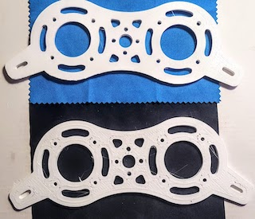
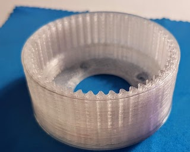
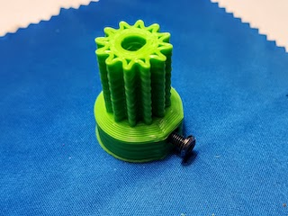
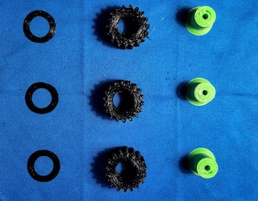
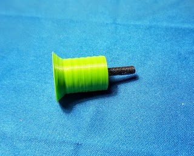
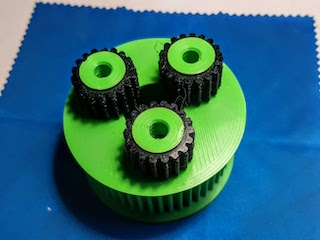
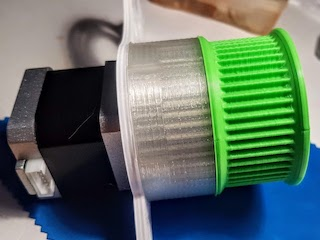
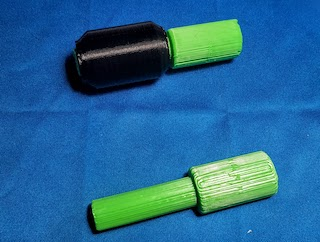
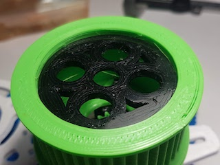
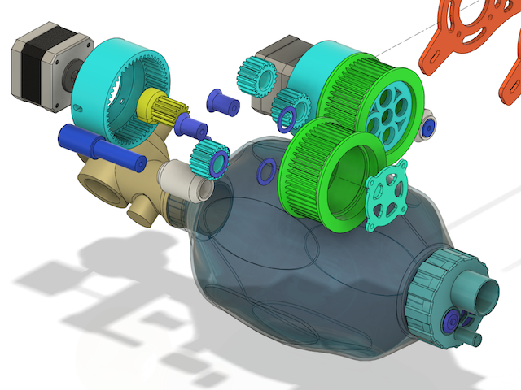

# CONCEPT 14: Fully printable mechanical model

---
## Scope: A mechanical model that can be printed and assembled by anyone

- Each part is designed for fast printing w/ 0.8 mm nozzle (still printable w/ 0.4 nozzle)
- You need only M3 screws to built it and two NEMA 17 motors to drive it
- You can easily test the assembly (e.g. by connecting the motors to your pinter's MB)
- It uses a combination of TPU and PLA/PET to manage friction and inconsistencies that may come from printing with 0.8
- The TPU also helps by providing high wear resistance for belt and gears

## To be done:
- Waiting for other people to print the parts and give feedback
- Waiting to test with high torque steppers

## Team Lead(s):
|GitLab|Slack|
|---|---|
| @madlex | @ Alex Mircescu |

## Slack Channels:  
- #design-hardware
- #design-fullyprintable

## Issue Labels:
-

## Overview:

The assembly was designed in **Autodesk Fusion** and all the parts will be available in this repository.
You can use and modify and use any parts of the design as you may see fit. 

Here you can download the **Fusion** model:
* [version 0.1](cad/Fusion_Assembly_V0_1.f3z)

## Parts list:

In this section we will describe the parts and which of them must be printed with flexibile material (e.g. TPU, Nylon) and which of them must be printed with rigid materials (PLA, PET, etc.).

The part list is:

| Name | Units | Type |
|---|---|---|
| Motor plate | 2 | rigid | 
| Ring | 2 | rigid |
| Output gear (planetary carrier) | 2 | rigid |
| Spacers | 2 | rigid |
| Planet axis | 6 | rigid |
| Guide stopper | 2 | rigid |
| Planet gears | 6 | flexible |
| Planet bushing | 6 | flexible |
| Output guide | 2 | flexible |
| Belt | 1 | flexible |

### Motor plates

Two identical motor plates connect all the pieces together. These parts are "work in progress" and they will most likely be modified in the near future.

### Fixed ring

This is the fixed planetary ring. It connects to the NEMA 17 motor, along with the motorplate, by four M3 screws, 31mm apart.

### Sun gear

It may look innocent, but it's probably the most problematic part. 

Make sure that:
* when printed with an 0.8 nozzle, the teeth are strong enough and can handle pressure
* once fitted on the motor axis, it's standing straight and doesn't osccilate when the motor is spinning
* the M3 screw can be firmly fastened against motor axis, without cracking the gear's plastic

### Carrier

The carrier is made out of multiple parts: 3 x TPU planet gears, 3 x TPU bushings, 3 x planet axis and the output gear. 

After you have the parts printed, mount the TPU gears on the rigid axis and add the TPU bushing on top. The axis and the planets present a chamfer on their lower end, which prevents the TPU gear from falling off. The bushing must be placed on top, between the output gear and the TPU planet gears. 

Use a screw to conect the axis to the output gear:

That is how it should look assembled:

If you have your carrier assembled, a motor plate and a ring, you can start testing the assembly. The TPU gears should provide enough friction so they lock themselves inside the fixed ring, for a test spin.

### Spacer and roller

These parts are the most likely to be changed in the next version. The spacer is printed up-right, which means it's strength relies on the Z lamination. The weakest point of a 3D printed part. Also, because both parts are printed up-right (the spacer and the roller), they don't glide very well against each other.

To connect the spacer to the motor plate, use two M3 10-15mm screws (one for each end). Make sure the spacer's inner diameter is wide enough and it's not cracking when you screw in the M3.

### Gear Guide

This part is printed out of TPU and it's designed to temper the outter gear's oscillations. These oscilations most likely can come from sun gear's imperfections or from sun gear misalignments. A properly mounted sun gear will greatly reduce those osciilations. 

### Guide stopper

Not the best part name to choose, but it has the role to meet the output gear guide and keep the outter gear in place. It must be connected to the top motor plate via four M3 6mm screws. The screw heads should lay inside the assembly, to occupy the least amount of space.

## The assembly

### Considerations:
Soon to be tested with for long term reliability.
