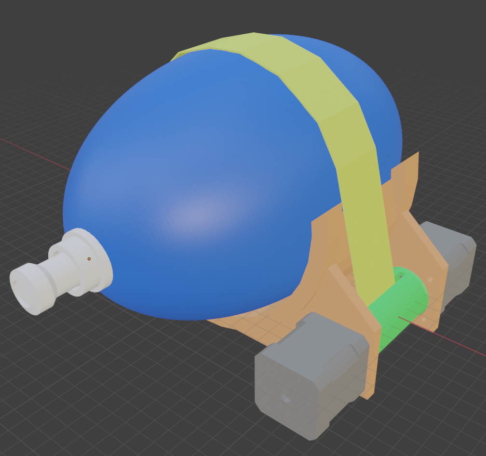

# Concept 6C1

</img>

## Assembly notes

- The pieces No_motor.stl and Gear.stl must be glued together for added security and resistance.
- The tape used for traction must be sewn on the ends in the shape of an o-shaped. Then we will introduce the travas when the tape is in place.